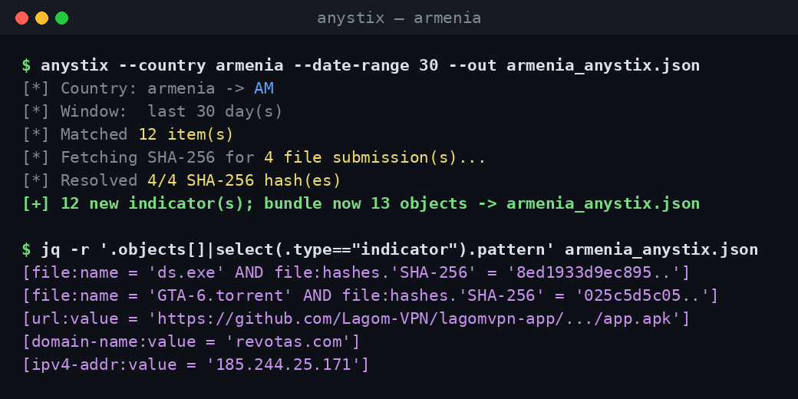

# AnyStix

Harvest **malicious public submissions from ANY.RUN by submission country** and
emit a **STIX 2.1** bundle (optionally push straight into OpenCTI).



## Why

[ANY.RUN](https://app.any.run/submissions) runs one of the largest **free,
public interactive malware sandboxes** on the internet — thousands of fresh
samples and URLs are detonated there every day, and every public analysis is
openly available. That firehose is a goldmine of **fresh, real-world threat
intelligence**, but it isn't organised around *your* threat model.

**AnyStix turns that public feed into a country-focused intel source.** Point it
at a country (e.g. `armenia`) and it pulls the malware and malicious URLs that
were **actually submitted from / targeting your region**, keeps only the
confirmed-malicious verdicts, enriches executables with their **SHA-256**, and
packages everything as standards-compliant **STIX 2.1**.

The result is an intelligence source you own and can act on for **proactive
defense**: feed the extracted **IoCs** (file hashes, URLs, domains, IPs) into
your detection and blocking stack — SIEM, firewall/proxy denylists, EDR, DNS
sinkholes — *before* those samples reach your users. Run it on a schedule
(systemd timer included) and the bundle grows incrementally as new threats
appear in your region.

Because the output is plain **STIX 2.1**, those IoCs import cleanly into
open-source threat-intelligence platforms — most notably **[OpenCTI](https://www.opencti.io/)**
(built-in `--push-opencti`), as well as MISP, Microsoft Sentinel, ThreatConnect,
and anything else that speaks STIX/TAXII — so the intelligence slots straight
into your existing workflow.

```
armenia ─▶ AM
        ─▶ Meteor DDP method getAnalysisPublicMobileAdvancedTi (country + dateRange)
        ─▶ paginate via nextCursor, keep verdict.threat_level == 2 (malicious)
        ─▶ STIX 2.1 bundle (incremental, deduped by task uuid)  ─▶ OpenCTI
```

## Browserless — how it works

`app.any.run` is a **Meteor.js** app; its public-submissions data is **not**
HTML or REST — it streams over a **Meteor DDP WebSocket** (`/sockjs/.../websocket`).
This tool speaks that protocol directly:

1. Open `wss://app.any.run/sockjs/<id>/<sess>/websocket`, send DDP `connect`.
2. Call method **`getAnalysisPublicMobileAdvancedTi`** with the filter object
   `{country:"AM", dateRange:[{$date:start},{$date:end}], ...}`.
3. Read the `result` → `{items[], totalHits, nextCursor}`; page forward by
   passing `cursor: <nextCursor>` until exhausted.
4. Keep items with `scores.verdict.threat_level == 2` and map to STIX.

No Chrome, no Selenium, no login, no Turnstile — and the output is clean JSON
instead of scraped HTML. (Country filtering needs no account; it is a plain
field on the public feed.)

`anyrun_ddp.py` is the self-contained DDP client; `anystix.py` is the CLI.

## Install

```bash
python3 -m venv .venv && . .venv/bin/activate
pip install -r requirements.txt
```

## Usage

```bash
# Malicious AM submissions from the last 30 days -> AM_anystix.json
python anystix.py --country armenia --date-range 30

# Cap volume / widen verdicts / choose output
python anystix.py --country armenia --max-items 200 --out armenia.json
python anystix.py --country DE --include-suspicious

# Push to OpenCTI (token from env — never hardcode it)
export OPENCTI_URL=https://127.0.0.1
export OPENCTI_TOKEN=********-****-****-****-************
python anystix.py --country armenia --push-opencti

# Offline: build STIX from previously captured items (see --dump-items)
python anystix.py --country armenia --from-json AM_items.json

# Quick smoke test of the raw fetcher
python anyrun_ddp.py AM
```

| Option | Description |
|--------|-------------|
| `--country` | Country name or ISO code (`armenia`, `AM`, `arm`). **Required.** |
| `--date-range` | Look-back window in days (default `30`). |
| `--out` | Output bundle path (default `<CC>_anystix.json`); updated incrementally. |
| `--max-items` | Cap malicious items collected. |
| `--include-suspicious` | Also include `threat_level == 1`. |
| `--no-hashes` | Skip per-task SHA-256 enrichment (file indicators then match on `file:name` only). |
| `--dump-items` | Also write the raw matched feed items to a JSON file. |
| `--from-json` | Build STIX from saved items instead of the network. |
| `--push-opencti` | Import the bundle via `pycti` (needs `OPENCTI_URL`/`OPENCTI_TOKEN`). |

## Run on a schedule (systemd, Ubuntu)

`install-service.sh` installs a hardened **systemd service + timer** for **one
country**. Each run writes to a persistent bundle under
`/var/lib/anystix/<country>_anystix.json`; because the tool dedups by task
UUID, every run appends **only new** malicious entries.

```bash
# install + schedule (hourly by default), copies app to /opt/anystix
sudo ./install-service.sh install --country armenia --interval 1h --date-range 30

# with OpenCTI push: fill /etc/anystix.env then add --push
sudo ./install-service.sh install --country armenia --push

sudo ./install-service.sh run-now             # trigger one harvest immediately
sudo ./install-service.sh status              # timer state + bundle
sudo ./install-service.sh logs                # recent journal output
sudo ./install-service.sh uninstall [--purge] # remove (--purge also drops data)
```

Notes: runs unprivileged via `DynamicUser` + `StateDirectory`; `--interval`
accepts systemd spans (`30min`, `1h`, `6h`). To track a different country,
re-run `install` with a new `--country` (it overwrites the unit).

## Output

STIX 2.1 `bundle` with:

- one `identity` ("ANY.RUN", fixed id so repeated runs merge into one source);
- one `indicator` per submission:
  - file → `[file:name = '...']`, url → `[url:value = '...']`, bare host →
    `[domain-name:value=...]` / `[ipv4-addr:value=...]`;
  - `labels: ["ANY RUN", "malicious", <kind>, *tags]`;
  - `external_references`: the ANY.RUN task link **and** an `anyrun-uuid`
    entry used as the incremental **dedup key**.

## Notes & limitations

- The public feed list has no hashes, so for each **file** submission the tool
  makes a second DDP call — `getTaskByUUID(uuid)` — and reads the main object's
  **SHA-256** from `public.objects.mainObject.hashes.sha256` (md5/sha1 ignored).
  File indicators then match on `file:name AND file:hashes.'SHA-256'`, and the
  SHA-256 is added as a `source_name:"sha256"` external reference. Use
  `--no-hashes` to skip this (one extra request per file submission).
- `getAnalysisPublicMobileAdvancedTi` is the "mobile" variant of the feed method
  (captured from the live app); there is a desktop twin that returns the same
  data. Override via `anyrun_ddp.DDP_METHOD` if ANY.RUN renames it.
- Respect ANY.RUN's Terms of Service and rate limits.
